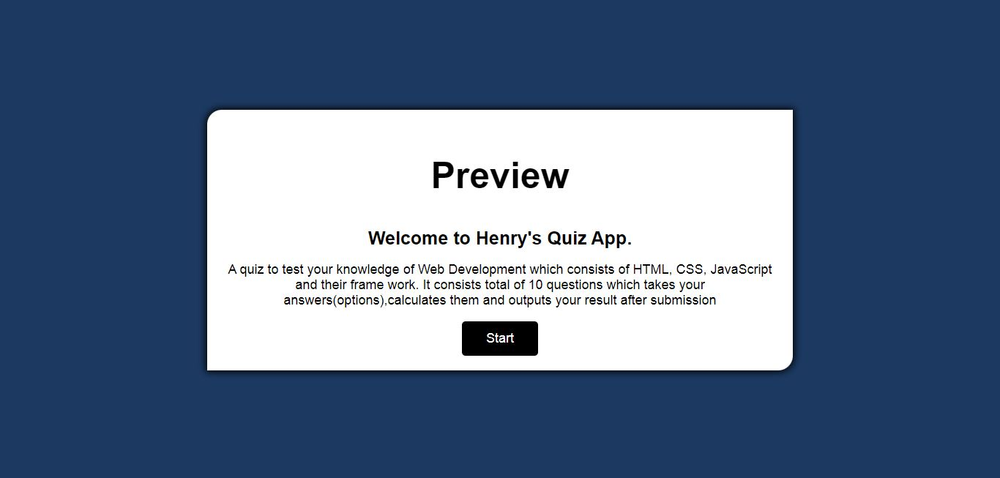
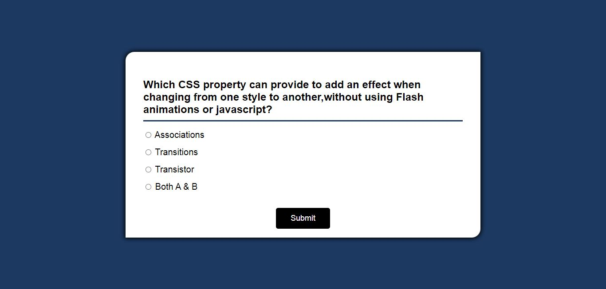
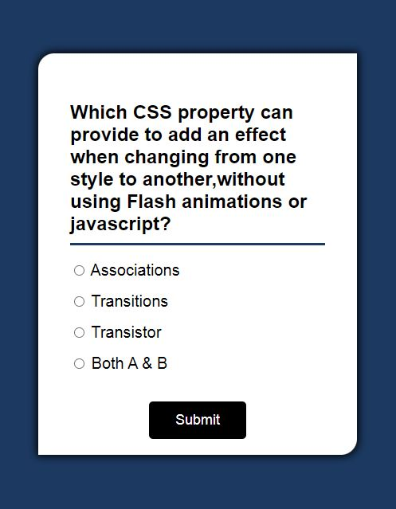

# Henry's Quiz App solution

This is a solution to a quiz app which was designed by Henry Agu. A quiz to test your knowledge of Web Development which consists of HTML, CSS, JavaScript and their frame work. It consists total of 10 questions which takes your answers(options),calculates them and outputs your result after submission.

## Table of contents

  - [The challenge](#the-challenge)
  - [Screenshot](#screenshot)
  - [Links](#links)
  - [Built with](#built-with)
  - [What I learned](#what-i-learned)
  - [Continued development](#continued-development)
- [Author](#author)

**Note: Delete this note and update the table of contents based on what sections you keep.**


### The challenge

Users should be able to:

- View the optimal layout depending on their device's screen size
- Pick whatever option of their choice
- Submit their answers 
- View their score immediately after the quiz is submitted

### Screenshot






### Links

- Solution URL: (https://Github.com/HenryAgu/QuizApp)
- Live Site URL: (https://incredible-biscochitos-b6165c.netlify.app/)

## My process

### Built with

- Semantic HTML5 markup
- CSS custom properties
- Flex box
- javaScript functions


### What I learned

- From this project, I understood practically how to hide and display elements using javaScript.
- I also learnt the use of flexbox instead of the regular media query.

See snippet below:

```javaScript
 startBtn.addEventListener('click',startGame);

function startGame(){
    startBtn.classList.add("hide");
    previewText.classList.add('hide')
    quizHeader.classList.remove('hide')
    submitBtn.classList.remove('hide')
}
```


### Continued development

I will like to proceed and try building a calculator next.


## Author

- Frontend Mentor - [@HenryAgu](https://www.frontendmentor.io/profile/HenryAgu)
- Twitter - [@_henryi](https://www.twitter.com/_henryi)
